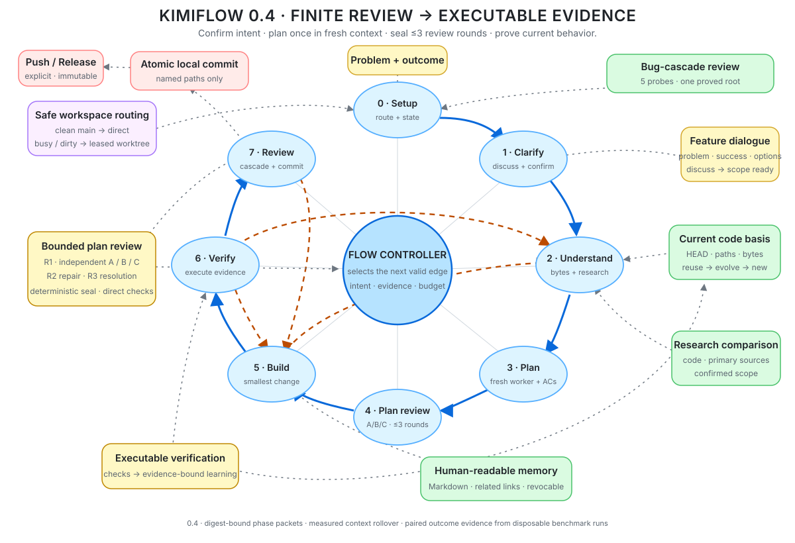

# kimiflow

**Ein tokeneffizienter Feature- und Bugfix-Flow mit mechanischen Gates für Claude Code und Codex.**

[English](README.md) | [Workflow-Referenz](reference.md) | [Beispiele](examples/README.md) | [Kompatibilität](COMPATIBILITY.md)

[](https://github.com/kimikonapps/kimiflow/releases/latest)

Kimiflow ist ein Workflow-Plugin, das explizit aufgerufen oder für substanzielle Feature-Arbeit
automatisch geroutet werden kann. Seine acht Phasen klären, verstehen oder diagnostizieren, planen,
reviewen, implementieren, verifizieren, prüfen den Code und committen. Bevor ein Feature im Code
festgelegt wird, bespricht Kimiflow den Produktablauf mit dem User, prüft die aktuelle Codebasis und
bindet wichtige Behauptungen an ausführbare Evidence.

<p align="center">
  <a href="https://kimikonapps.github.io/kimiflow/">
    
  </a>
  <br>
  <sub><a href="https://kimikonapps.github.io/kimiflow/">Interaktiven Graph öffnen</a></sub>
</p>

Kimiflow kann konkrete Umsetzungsauftraege fuer substanzielle Feature-Arbeit automatisch routen.
Diskussionen, Ideen, Empfehlungen, Erklaerungen, Statusfragen und Wunschformulierungen bleiben direkt
und read-only. Fixes und kleine risikoarme Aenderungen bleiben ebenfalls direkt, sofern du nicht
`/kimiflow` in Claude Code oder `$kimiflow` in Codex aufrufst. Explizites `direct` oder `direkt`
umgeht Kimiflow immer.

## Warum Kimiflow

Claude Code und Codex können bereits planen, delegieren und reviewen. Kimiflow legt darum einen
dauerhaften, wiederaufnehmbaren Qualitätsvertrag:

- State und Evidence liegen unter `.kimiflow/<slug>/`;
- Plan- und Code-Review-Gates lösen BLOCKER/HIGH mechanisch auf;
- wiederholte Runtime-Behauptungen brauchen ausführbare Evidence; irrelevante Findings stoppen vor dem Repair und wiederholte Fehlstrategien erzeugen keinen Endlos-Loop;
- Bugfixes brauchen Reproduktion, belegte Ursache und Red/Green-Evidence;
- wesentliche Produkt-/Berechtigungsentscheidungen warten auf menschliche Freigabe; verifizierte lokale Commits laufen automatisch, Push und Release bleiben explizit;
- nur erfolgreich verifizierte Learnings werden kuratiert;
- das stärkste gewählte Modell orchestriert, kleinere Worker übernehmen begrenzte Aufgaben.

Der Default ist nicht der größte, sondern der kleinste Flow, der die konkrete Arbeit sicher trägt.

## First Principles

- **Verstehen, bevor gebaut wird.** Kimiflow zeigt Problem, beobachtbaren Erfolg, Grenzen, Optionen und den vollständigen User-Ablauf in der Sprache des Users. Vor der Implementierung kann dieser Vertrag besprochen und korrigiert werden.
- **Aktueller Code schlägt erinnerten Code.** Planung bindet aktuellen HEAD sowie Typ und Bytes aller betroffenen Pfade. Kimiflow prüft `reuse → evolve → new`, damit vorhandene Funktionen nicht doppelt gebaut werden.
- **Recherche fordert die lokale Idee heraus, erweitert aber nicht das Produkt.** Projekt-Evidence kommt zuerst; aktuelle Primärquellen schließen benannte Lücken und werden mit Code und bestätigtem Scope verglichen.
- **Runtime-Behauptungen brauchen Runtime-Evidence.** Wichtige Entscheidungen verlangen Review, isolierten Spike oder ausführbaren Laufzeitnachweis. Ein reines „passed“ in Prosa reicht nicht.
- **Reviews sind verhältnismäßig und endlich.** Findings werden nach Vertrag, unterstütztem Pfad, Impact und Reparaturkosten klassifiziert. Irrelevante Randfälle gehen nicht in den Repair-Loop; Security, Privacy, Datenverlust und irreversible Auswirkungen bleiben geschützt.
- **Die kleinste austauschbare Lösung gewinnt.** Features, Integrationen, Modelle und Review-Routen sollen leicht ergänzt, angepasst oder entfernt werden können. Bestehende Verträge werden weiterentwickelt, bevor neue Systeme entstehen.
- **Learnings bleiben Evidence-gebunden.** Dauerhafte Erkenntnisse nennen aktuelle Quellpfade und werden automatisch stale, wenn sich deren Bytes ändern.

## Installation

Voraussetzungen: `jq`, Git und `python3 >= 3.9` im `PATH`.

### Claude Code

In Claude Code:

```text
/plugin marketplace add kimikonapps/kimiflow
/plugin install kimiflow@kimiflow
```

Oder im Terminal:

```bash
claude plugin marketplace add kimikonapps/kimiflow
claude plugin install kimiflow@kimiflow
```

Danach Claude Code neu starten oder eine neue Session öffnen. Update:

```bash
claude plugin update kimiflow
```

### Codex

```bash
codex plugin marketplace add kimikonapps/kimiflow
codex plugin add kimiflow@kimiflow
```

Danach Codex neu starten, unter `/hooks` die gebündelten Kimiflow-Hooks einmal prüfen und freigeben und eine neue
Task öffnen. Codex verlangt diese Sicherheitsfreigabe absichtlich erneut, wenn ein Plugin-Update eine Hook-Definition
ändert. Update:

```bash
codex plugin marketplace upgrade kimiflow
```

Codex lädt den gebündelten Hook-Vertrag über den im Plugin-Manifest deklarierten `hooks`-Pfad. Es sind keine
Wrapper im User-Verzeichnis nötig. Der Marketplace veröffentlicht nur den sauberen Runtime-Kandidaten;
Maintainer-State, Eval-Eingaben und private Workflow-Artefakte bleiben draußen. Ein reproduzierbarer
Inhalts-Fingerprint bindet die ausgelieferten Dateien.

Für lokale Entwicklung kann der deklarierte Vertrag geprüft werden:

```bash
codex plugin marketplace add .
bash hooks/install-codex-hooks.sh --check
```

### Optionaler provider-neutraler Terminal-Runner

Das eingebettete Plugin bleibt der Standard. Für lange Kimiflow-Aufgaben aus dem Terminal gibt es zusätzlich
einen dünnen Controller, der nicht nach jedem Turn eine Bestätigung braucht:

```bash
bash hooks/install-kimiflow-cli.sh
kimiflow run "setze das gewünschte Feature um"
kimiflow status --pretty
```

### Optionaler Pi-Captain

Das Repository liefert zusaetzlich ein installierbares Pi-Paket fuer Pi 0.82.x und 0.83.x. Sobald das
Kimiflow-Paket in einer laufenden Pi-Sitzung geladen ist, kannst du Pi natuerlich mit einem Feature
„mit Kimiflow“ beauftragen:

```bash
pi install /absoluter/pfad/zu/kimiflow
```

Der Pfad kann dieser vertrauenswuerdige Checkout oder das aus einem verifizierten Runtime-ZIP entpackte
`kimiflow/`-Verzeichnis sein. Mit `pi install -l /absoluter/pfad/zu/kimiflow` wird es nur fuer das aktuelle
Projekt installiert. Pi registriert damit das Paket und laedt seine deklarierten Extensions und den Skill;
ein temporaeres `pi -e` ist kein unterstuetzter Paket-Installationsweg.

```text
Baue das gewuenschte Feature mit Kimiflow.
/kimiflow setze das gewuenschte Feature um
/kimiflow-status
```

Der natuerliche Auftrag und der optionale Slash-Befehl verwenden dieselbe dauerhafte Aktivierung. Diese
Pi-Sitzung bleibt der ansprechbare, nur lesende Captain. Eine private reine Metadaten-Registry
(`/kimiflow-project` oder Tool `kimiflow_project`) ordnet Projektnamen exakten Git-Roots zu; Prompts, Code,
Antworten und Terminal-Transkripte werden dort nicht gespeichert. Mit
`/kimiflow --project <name> <auftrag>` oder dem optionalen `project`-Feld des Aktivierungs-Tools wird ein
registriertes Projekt explizit gewaehlt.

Jeder schreibende Top-Level-Auftrag wird vor dem Pi-Start durch den bestehenden Fleet-Broker geroutet. Auch ein
sauberer Primary-Checkout erhaelt einen eigenen Kimiflow-Worktree, ein Runner-Receipt, eine Pi-Sitzung und einen
Endpunkt. Bis zu drei disjunkte Auftraege koennen parallel laufen; weitere bleiben in der Broker-Queue. Solange
Fleet-Arbeit laeuft, bietet der Captain nur Lese-/Such- und Kimiflow-Control-Tools an. Ein toter fortsetzbarer
Runner darf seine Bridge erst nach positivem Nachweis des beendeten Controllers an einen neuen Captain
uebergeben; Provider-Sitzung und Run-Besitz bleiben unveraendert.

Der Pi-Adapter uebernimmt die providerneutrale Auswahl `provider/model:thinking`. Active Run, Fleet-Leases,
Gates und terminale Receipts bleiben die dauerhaften Workflow-Autoritaeten; nur der Runner verbindet sie mit
der Controller-Erreichbarkeit zu einer normalisierten Lifecycle-Sicht fuer Hosts. Der Captain zeigt diese Sicht
an und leitet Befehle weiter, ohne rohe Receipt-Status oder Prozess-IDs selbst zu interpretieren. Reply und
Steering adressieren die exakte Run-/Worker-/Provider-Sitzungs-Grenze; Pi- oder Herdr-Lifecycle-Text beweist nie
den Abschluss.

Laeuft der Captain in Herdr, erhaelt jeder Fleet-Worker einen eigenen nicht fokussierten interaktiven Pi-Tab im
Workspace des Captains und startet im isolierten Worktree. Temporaere begrenzte semantische Agents verwenden
eigene Tabs. Kimiflow kopiert die benutzerverwaltete Herdr-Pi-Agent-State-Integration digestgebunden und laedt
sie auch mit `--no-extensions` explizit; dadurch bleibt die native `agent_session`-Identitaet beim Resume
sichtbar. Kimiflow besitzt nur seine exakten Tab-IDs. Ausserhalb von Herdr bleibt der Prozess-Transport
unveraendert; Kimiflow installiert weder Pi noch Herdr oder einen Modell-Provider.

Eine Anfrage mit einem bestehenden nummerierten Plan (zum Beispiel `Run 7`) waehlt nur diesen exakten
Projektplan; sie kann weder versehentlich `Run 7.2` verwenden noch bestaetigte Fakten durch generische Intake-
Fragen ersetzen.

Dieses Paket ist additiv. Ohne Installation oder Aktivierung in Pi bleiben die
eingebetteten `$kimiflow`-Codex- und `/kimiflow`-Claude-Code-Wege, ihre Hooks und der optionale Terminal-Runner
unveraendert.

Codex ist der eingebaute Adapter. Ein vorhandenes lokales oder entferntes Coding-Agent-Harness kann denselben
Lebenszyklus über den versionierten JSON-stdio-Vertrag ausführen:

```bash
kimiflow run --adapter command --adapter-command mein-agent-harness --model qwen-local \
  "setze das gewünschte Feature um"
```

Das Harness muss Datei-, Shell-, Test-, Resume- und Gate-Fähigkeiten ausweisen. Kimiflow hält Workflow,
mechanische Gates, Active-Run-Ownership, das begrenzte Turn-Limit und Usage-Receipts provider-neutral; der Adapter
besitzt nur Modelltransport und Tool-Ausführung. Es entstehen kein Daemon, zweiter Memory-Store oder Worktree.
Ein persistiertes Turn-Limit plus genau ein abschließender Recovery-Turn verhindert Endlosschleifen; ein
ausgeschöpfter Run bleibt ausdrücklich fortsetzbar, statt Erfolg zu behaupten.

Nur ein materieller Kimiflow-Wait oder Park endet mit Status 3. Die Antwort erfolgt mit
`kimiflow resume --message "<entscheidung>"`; unterbrochene oder transportbedingt gestoppte Runs können ohne
Message fortgesetzt werden, solange ihr Active Run offen ist. Der lokale Receipt enthält nur Transportdaten,
niemals Auftrag oder Transkript. `bash hooks/install-kimiflow-cli.sh --check` prüft den verwalteten Wrapper; ein
fremdes `kimiflow`-Executable wird nicht überschrieben.

### Einheitliche lokale Run-Steuerung

Rich Clients und Modell-Adapter können `hooks/run-bridge.sh` als JSON-stdio-Grenze für jeweils einen Aufruf
verwenden. Sie liefert eine deterministische Readiness-Sicht, akzeptiert nur owner-gebundene replay-sichere
Item-Mutationen und stellt inhaltsfreie Phase-Context-Metadaten sowie eine mehrdimensionale terminale Scorecard
bereit. Active Run, Graph, Phasen-, Review- und Finish-Gates bleiben maßgeblich; es entsteht weder Daemon noch
Netzwerkdienst oder Provider. Der Phase Context bleibt Shadow-Evidenz und ersetzt nie die jeweilige Phase-Datei
plus deren exakt zugewiesene Referenzabschnitte; `reference.md` wird nicht vollständig vorgeladen.
Terminale Scorecards bleiben nach dem Ende des Active Run über einen expliziten sicheren Run-Pfad lesbar.

### Optionale Kontinuität für Architekturänderungen und Multi-Run-Programme

Der normale einzelne Kimiflow-Run bleibt unverändert. Für größere Vorhaben gibt es drei explizite lokale
Kommandos:

- `hooks/build-replan.sh` springt aus Phase 5 nur mit aktueller Evidence für eine widerlegte PLAN-Annahme zurück; normale Testfehler bleiben im Build.
- `hooks/project-delta.sh` speichert nach einem erfolgreichen committeten Run eine verifizierte Architekturänderung und lädt sie später nur bei passenden betroffenen Pfaden.
- `hooks/program-engine.sh` validiert einen DAG unter `.kimiflow/programs/<name>/PROGRAM.json` und wählt genau einen deterministischen nächsten Run.

Die Program Engine bleibt absichtlich seriell und mechanisch. Sie journalisiert und bestätigt Aktivierungen
dauerhaft, bindet einen Run exklusiv sowie terminale Evidence und finale Checks, startet aber nie Agent, Run,
Branch oder Worktree. Ohne
Program beziehungsweise Project Delta entsteht kein zusätzlicher Modell-Kontext. Details:
[`references/program-v1.schema.json`](references/program-v1.schema.json) und
[`reference.md`](reference.md#optional-project-continuity-and-program-scheduling).

### Optionale projektspezifische Release-Profile

Ein ausdrückliches `kimiflow release` oder „Release Flow“ kann ein lokales, provider-neutrales Profil unter
`.kimiflow/release/` verwenden. Kimiflow erkennt getrackte Release-Controls, bindet ein Modell-Audit an deren
exakte Digests und verwendet es weiter, bis sich ein Control ändert oder ein echter Release-Fehler auftritt.
Ein Auftrag autorisiert genau einen seriellen Release-Lauf; mutierende Schritte brauchen mechanische Vor- und
Nachbedingungen, unklare Effekte werden nie blind wiederholt und projektspezifische Final-Checks müssen
bestehen. Nach echten Fehlern muss das neue Audit an den exakten Fehlerbeleg gebunden sein.
Audit-Verbesserungen bleiben evidenzgebundene Hinweise und verändern keine laufende Veröffentlichung.
Ohne Release-Auftrag wird kein Profil-Kontext geladen.

Schema-v2-Profile ergänzen typisierte öffentliche Laufzeit-Inputs, projekt- und zielgebundenes privates
Release-Memory, kurzlebige Provider-Identität, granulare Retry-Klassen und die exakte Wiederverwendung von
Phase-6-Evidence. Nicht-GitHub-Releases verwenden die generische `environment`-Identität mit ausschließlich
projektseitig deklarierten kurzlebigen Credentials und müssen mindestens ein öffentliches Publikationsziel
deklarieren, damit ein Wechsel zwischen Registry, App Store oder internem Ziel keine fremde Memory übernimmt.
Der Release-Effekt muss dieses Ziel explizit verwenden. GitHub ist ein optionaler Adapter und bevorzugt ein natives
Token. Der lokale GitHub-Fallback verwendet den durch einen
erfolgreichen Release bestätigten Account weiter (beim ersten Lauf alternativ den Autor des letzten Releases),
validiert die Schreibberechtigung für das Repository erneut und schaltet den globalen `gh`-Account nicht um.
Credentials, rohe Inputs, Kommandoausgaben und absolute Pfade
werden nie gespeichert. Credential-haltige temporäre Homes liegen zwingend außerhalb des Projekts, werden
durch einen unabhängigen Controller-Death-Wächter bereinigt und nach einem Host-Neustart über lokale Leases
wieder eingesammelt.
Provider-Output wird schon während der Ausführung begrenzt und `env`-Wrapper dürfen die versiegelte
HOME-/XDG-/Provider-Konfiguration nicht ersetzen. Die interne Repository-Erkennung verwendet ein festes
System-Git statt des umgebenden `PATH`. Mit `relative_path`, statischen lokalen Effect-Argumenten oder
Affected-Paths benannte Laufzeit-Artefakte durchlaufen vor einem Effekt einen begrenzten eingebauten
Credential-Scan. Verzeichnisinhalt und Bytes sind snapshot-gebunden; ZIP-/tar-Inhalte werden geprüft, während
unsichere, verschlüsselte, verschachtelte oder nicht unterstützte Container fail-closed stoppen. Verdächtige
Unterpfade, bekannte Token-Formen und das aktuelle kurzlebige Credential stoppen, ohne Inhalte zu speichern.
Nicht verwendete Release-Inputs
wie ein neuer Tag invalidieren
einen davon unabhängigen Check nicht; jedes vom Kommando tatsächlich verwendete Relative-Path-Input, seine
betroffenen Bytes, Umgebung und adoptierten externen Tool-Fingerprints müssen weiterhin exakt übereinstimmen.
Unveränderte Releases überspringen damit wiederholte Discovery, Audits, Modellarbeit
und bereits aktuelle Checks. Innerhalb einer unterbrochenen Generation werden abgeschlossene
nicht-authentisierte Checks nur bei weiterhin identischem Pfad-, Umgebungs-, PATH- und Tool-Kontext
wiederverwendet; authentisierte Checks laufen stets erneut. Das Release-Memory wird datei- und
verzeichnis-fsynced idempotent vor dem Completed-Marker geschrieben und bei einem alten abgeschlossenen Lauf
mit fehlendem oder malformed Memory repariert, ohne Projektarbeit zu wiederholen. Echte Projektprüfungen,
Builds und Provider-Schritte laufen weiterhin, sobald
Evidence fehlt oder veraltet ist. Provider-authentisierte Checks werden nie wiederverwendet; sie laufen immer
mit der aktuellen kurzlebigen Release-Identität. Lokale inhaltsfreie Metriken trennen Control-, Check-, Build-
und Provider-Arbeit—ein fixes Release-Zeitbudget gibt es bewusst nicht. Siehe
[`references/release-profile-v2.schema.json`](references/release-profile-v2.schema.json).
`kimiflow release` meldet ein bestehendes bereites v1-Profil einmalig als `upgrade_required` und leitet den
tatsächlichen Provider aus getrackten Controls ab; ein aktiver v1-Lauf wird zuerst sicher beendet. Direkte
v1-Ausführung bleibt kompatibel.

## Demo


> Geskriptete Illustration von Feature-Gespräch, Codebasis-Prüfung, Evidence-Klassen,
> relevanzbewusstem Review und lokalem Commit. Quelle und Anleitung für einen
> echten Mitschnitt liegen unter [`docs/demo/`](docs/demo/).

## Modi

Die Modi funktionieren mit `/kimiflow` in Claude Code und `$kimiflow` in Codex gleich.

| Modus | Zweck |
|---|---|
| `kimiflow full` | Strenger Large-Flow; pausiert nur für eine wesentliche Entscheidung. |
| `kimiflow quick` | Schlanker Weg für kleine, risikoarme Änderungen. |
| `kimiflow fix` | Erst diagnostizieren, dann begrenzt fixen und Red/Green verifizieren. |
| `kimiflow grill` | Nur den Auftrag klären; kein Plan und kein Code. |
| `kimiflow plan` | Intent, Recherche, Plan und Akzeptanzkriterien vorbereiten; kein Code. |
| `kimiflow build` | Einen freigegebenen vorbereiteten Plan umsetzen. |
| `kimiflow review` | Bestehendes Feature oder aktuellen Diff read-only prüfen. |
| `kimiflow audit` | Cleanup-/Refactoring-Audit vor Auswahl eines Slices. |
| `kimiflow release` | Bei Bedarf importieren/neu auditieren und genau einen Projekt-Release ausführen. |

Explizite Formen:

```text
/kimiflow <feature-oder-bug>
/kimiflow --fix <bug>
/kimiflow --verify-feature <feature-oder-pfad>
/kimiflow <auftrag> --prepare
/kimiflow --resume <slug>
/kimiflow --project-map quick
/kimiflow release
```

Jedes nicht-triviale Feature—auch ein bereits vorbereiteter Plan—beginnt mit einem kurzen
Produktgespräch in der Sprache des Users. Kimiflow prüft aktuellen Code und zeigt danach das verstandene
Problem, beobachtbaren Erfolg, Grenze, zwei bis fünf relevante Optionen sowie `enthalten`, `später` und
`nicht enthalten`. Der User kann den Entwurf besprechen und korrigieren, bevor er `scope_ready` wählt.
Danach vergleicht gezielte Recherche aktuelle Codebasis, Primärquellen und bestätigten Scope. Der finale
Produktablauf mit zwei bis sieben Schritten wird nur über `confirmed` akzeptiert oder über `corrected`
ersetzt; generischer Chat und Timeouts bestätigen nichts. Der User entscheidet WHAT/WHY, der Agent
Architektur, Libraries, Datenmodell, Tests und anderes technisches HOW. Fixes und exakt triviale Arbeit
behalten ihre direkten Routen.

## Acht Phasen

| Phase | Ablauf |
|---|---|
| 0 Setup | Alle Worktrees inventarisieren, dauerhaften Run-State anlegen, sichere Aufräumentscheidung einmal bündeln. |
| 1 Klären | Code-informierten Problem-/Erfolgs-/Optionsentwurf zeigen, besprechen lassen und danach den korrigierten Produktablauf über explizite strukturierte Aktionen sperren. |
| 2 Verstehen | Aktuelle betroffene Pfade und Bytes erfassen, `reuse → evolve → new` prüfen und gezielte Recherche mit dem bestätigten Scope vergleichen. Fixes reproduzieren und belegen die Ursache. |
| 3 Planen | Flachen minimum-complete Plan, testbare Akzeptanzkriterien und höchstens fünf Entscheidungen mit `review_only`, `spike_required` oder `runtime_required` schreiben. |
| 4 Review | Plan-Blocker lösen; nur bei Autorität, materiellem Scope/Risiko, Privacy/Kosten oder Irreversibilität pausieren. |
| 5 Umsetzen | Kleinste akzeptierte Änderung bauen; Fixes sichern Red-Evidence vor Production-Code. |
| 6 Verifizieren | Erforderliche Akzeptanz-, Regressions-, Spike- und Runtime-Evidence ausführen und jede gesperrte Anforderung nachweisen. |
| 7 Review und Commit | Findings nach Vertrag, unterstütztem Pfad, Impact und Verhältnismäßigkeit einstufen, nur relevante Defekte reparieren und danach den lokalen Commit beweisen. |

## Mechanische Gates

„Mechanisch“ bedeutet: Ein getestetes Skript oder ein Hook entscheidet, nicht ein Selbstbericht.

| Gate | Gesicherte Grenze |
|---|---|
| Workspace-Preflight | Alle Worktrees und Dirty-Pfade werden klassifiziert; bis zu drei eigene Fleet-Trees erhalten exklusive Leases, Revalidierung, serialisierte Candidate-first-Integration und Ancestry-gesichertes Archivieren. |
| Product-Intake-/Clarify-/Discovery-Gates | Planung und Writes bleiben gesperrt, bis der User den Scope explizit bereit markiert und den finalen Produktablauf bestätigt; generischer Chat, Defaults und Timeouts bestätigen nichts. |
| Aktueller Code und Plan | Jeder betroffene Pfad wird an aktuellen HEAD, Typ und Bytes gebunden; Discovery belegt `reuse → evolve → new`, materielle Entscheidungen deklarieren ihre Evidence-Klasse. |
| Plan-/Review-Gates | AC-Mapping und belegte BLOCKER/HIGHs werden begrenzt gelöst; reproduzierte immaterielle Randfälle gehen nicht in Repair, geschützte Auswirkungen können nicht weggewischt werden. |
| Implementation-Conformance-Gate | Rechercheentscheidungen, Invarianten, Pfade, Checks und jede gesperrte Produktanforderung konvergieren in Phase 6; beim Abschluss muss zusätzlich der Commit exakt dem geprüften Stand entsprechen. |
| Adaptiver Execution-Controller | Run-weites No-Progress und Budgetdruck wählen eine begrenzte Recovery-Aktion; verpflichtende Qualitäts-Gates bleiben erhalten. |
| Evidence-Evaluation | Vier kritische Flow-Verhalten laufen in CI genau einmal gegen eine versiegelte Baseline des vorherigen Releases; Artefakte enthalten nur begrenzte Metadaten und Digests, nie Prompts, Output, Code, Secrets oder absolute Pfade. |
| Lokale Run-Steuerung | Hosts erhalten einen Readiness-/Cursor-Vertrag; gemeinsames Locking, Owner-Nachweis und Action-Receipts machen unterstützte Item-Mutationen fail-closed und replay-sicher. |
| Materielle-Entscheidungs-Gate | Reversible Technik läuft weiter; nur Autorität, Risiko, Zugriff, Privacy/Kosten oder Irreversibilität pausieren. |
| Red/Green-Gate | Fixes brauchen aufgezeichnete failing/passing Evidence und Regression. |
| Atomic-Commit-Gate | Schema-4-Runs stagen Named Run-Paths und committen lokal unter der ursprünglichen Bau-Freigabe. |
| Secret-/State-Hooks | Verdächtige Pfade, Bulk-Staging und Resolver ohne dauerhaften State werden blockiert. |
| Test-Gate | Large-Runs können Abschluss blockieren, solange der konfigurierte Test rot ist. |

Scope, Root-Cause-Qualität und Vollständigkeit der Reviewer bleiben Modellurteile. Kimiflow
mechanisiert die Evidence-Grenzen, ohne Allwissenheit vorzutäuschen.

## Tokeneffiziente Skalierung

- `trivial`: exakte risikoarme Arbeit; kurz umsetzen, verifizieren und lokal committen.
- `small`: Default; kompakte Klärung, adaptive Discovery, ein Planner, begrenztes Review.
- `large`: nur für breite Änderungen, neue Dependencies, Migrationen, Security/Privacy/Money,
  subtile Bugs oder explizites `full`.
- Discovery startet für `none|pulse` keinen Worker, für `focused` normalerweise einen begrenzten
  Evidence-Worker und höchstens zwei unabhängige Lanes.
- Recherche darf die Umsetzung korrigieren; nur `required` Constraints dürfen Scope hinzufügen.
- Conformance speichert höchstens fünf materielle Entscheidungen; `small` braucht keinen zusätzlichen Modell-Call, `large` nutzt den bestehenden unabhängigen Verifier mit.
- Execution nutzt drei feste Qualitätsprofile mit expliziter Auswahlbegründung und einen kompakten lokalen Trace; bei hartem Druck fällt optionale Breite weg, nicht Verifikationsqualität.
- Ein zweiter Planner erscheint nur bei echter Architektur- oder irreversibler Contract-Gabel.
- Das Top-Modell behält Orchestrierung, Synthese, Planung, Review-Verdicts und riskante Diagnose.
- Ein deterministischer Classifier erhöht den Scope anhand von Subsystem-, Daten-, Security-, Integrations- und
  Irreversibilitäts-Evidence, beantwortet aber niemals eine offene Produktentscheidung.
- Große, materiell veränderte Kontexte rollen nur bei gemessenem Druck um; kleine Runs bleiben unverändert.
- Günstigere Modellrouten werden erst nach fünf vergleichbaren sauberen Outcomes freigeschaltet, bei Regression
  entzogen und nie für kritische Arbeit verwendet.
- Die deterministische Behavior-Evaluation braucht keinen Modell-Call. Modellbewertete Kalibrierung wird nur
  als nicht-ausführender Release-Plan abgebildet und bleibt außerhalb normaler Runs und CI.

`small` und `quick` überspringen breiten Memory-Recall und den **Vault Pulse** standardmäßig. Ein
ausdrücklicher Hinweis, dass ein ähnlicher Bug oder Fix schon existierte, löst stattdessen bei jedem
Scope genau einen gezielten lokalen Recall mit höchstens fünf Treffern und ohne Provider-Suche aus.
Current-State-Checks und Learning-Review bleiben bei jedem nicht-trivialen Run erhalten.

Domänenkomplexität und Betriebswirkung sind getrennte konditionale Verträge. Wenn aktiv, braucht jeder eine
typisierte Research-Zeile, einen AC-verknüpften Plan-Check und passende Verification-Evidence. Wenn inaktiv
entsteht kein zusätzlicher Prompt-Overhead.

## Projektwissen und Memory

Kimiflow kann unter `.kimiflow/project/` eine lokale Projektkarte mit Codebase-, Architektur-,
Konventions-, Test- und Flow-Evidence anlegen. Spätere Runs prüfen betroffene Bereiche und erneuern nur
stale Abschnitte. Die Map ist optional, lokal und blockiert normale Arbeit nicht.

Der Memory Router speichert begrenzte Projektfakten, Entscheidungen, Standards, Run-Historie und
evidence-basierte Learnings. Neue projektlokale Learnings beginnen als `probationary`: Sie bleiben
gezielt abrufbar, gelangen aber noch nicht in Always-on-Memory, Vorschläge, Provider-Sync oder portable
Capsules. Erst zwei verifiziert hilfreiche Anwendungen bei weiterhin exakter Source-Evidence machen sie
`durable`; diese Anwendungen sind zusätzlich an einen Fingerabdruck desselben Learning-Inhalts gebunden, sodass
umgeschriebener Inhalt keinen alten Erfolg erbt. Widerspruch, Inhalts- oder Evidence-Drift stuft Vertrauen
reversibel zurück. Bestehende Zeilen ohne
Maturity-Feld behalten ihr bisheriges dauerhaftes Verhalten.
Der Fingerabdruck umfasst jedes Recall-sichtbare Feld außer expliziten Lifecycle-Metadaten, sodass auch ein
künftiges Feld keine frühere Verifikation stillschweigend erben kann.
Abgeschlossene Runs erhalten außerdem eine automatische lokale Outcome-Evaluation. Künftige passende
Runs sehen höchstens eine verifizierte Erfolgsstrategie und eine belegte Fehlstrategie; beide werden
gegen den aktuellen Code erneut geprüft.
Recall packt Memory, Fakten, Learnings, Strategien und Historie nun in ein einziges globales
Context-Budget und ein globales Trefferlimit und entfernt quellenübergreifende Duplikate. Recall bleibt
immer ein Hinweis: aktueller Code, Tests, Specs und Primär-Evidence gewinnen. Der optionale SQLite-Index
wird nur mit aktuellem Source-Fingerprint verwendet; stale Indizes werden ignoriert und bei einem
persistierten Recall atomar neu gebaut.
In großen Monorepos leitet Run-Artefakt-Recall aus den betroffenen Dateien höchstens acht verschachtelte
Package-Einheiten ab und reiht deren Evidence zuerst. Root-Regeln und Evidence ohne nachweisbare Package-Grenze
bleiben global; ungültige, gemischte, zu große oder während des Recalls veränderte Grenzen führen sicher zu
projektweitem Recall. Dafür gibt es nur begrenzte Ancestor-Checks—keinen Repo-Scan, Dependency-Graph,
Worktree-Write, Netzwerkzugriff oder User-Gate.
Finale Treffer erhalten außerdem stabile lokale IDs. Kimiflow zählt eine ID nur dann als verwendet, wenn
sie tatsächlich eine Plan-Entscheidung prägt, verbindet sie mit der Verifikation und bewertet sie im
bestehenden Outcome-Artefakt als `helpful`, `neutral` oder `contradicted`. Dafür entstehen weder externe
Telemetrie noch kopierte Recall-Texte oder eine neue User-Bestätigung.

Memory-Pflege ist Preview-first und reversibel. `memory-router.sh lifecycle` erklärt einen begrenzten
Utility-Score von 0–5, Promotionen, Rückstufungen und Quarantäne-Kandidaten. Erst nachdem der
Terminal-Status atomar geschrieben und die Outcome-Auswertung erfolgreich persistiert wurde, führt
Kimiflow diese Kuratierung automatisch und modellfrei aus und schreibt nur einen kompakten
`memory_curation`-Beleg. Eine kooperative 20-Sekunden-Deadline rollt die auf 8 MiB und 4096 Quellzeilen
begrenzte Learning-/Text-Derivate-Transaktion vor dem 30-Sekunden-Host-Timeout zurück und wird beim erfolgreichen Derivate-Commit deaktiviert; Timeout oder andere
Curation-Fehler bleiben sichtbar, halten den abgeschlossenen
Run aber nicht an. Writes ohne Änderung bleiben byte-identisch.
`lifecycle --write` wertet dafür das bestehende verifizierte Outcome-Ledger strikt und begrenzt aus und
quarantänisiert stale Zeilen nur, wenn sie nachweislich nie verwendet wurden und eine eindeutige ID haben.
Fehlende versiegelte Recall-Evidence sperrt die Kuratierung; eine fehlgeschlagene Outcome-Persistenz lässt
den Run für einen autonomen Abschlussversuch wiederaufnehmbar. Producer und Lifecycle teilen sich einen lokalen
Ledger-Lock, lehnen Duplicate-Keys ab, zählen jeden Run nur einmal und verwenden die serialisierte Ledger-Reihenfolge
statt veränderbarer Zeitstempel für die Vertrauenskausalität. Persistierter Recall und Lifecycle teilen zusätzlich
den Usage-Ledger-Lock mit derselben physischen Identität auch über Root-Aliase, sodass ein gerade verwendetes
Learning nicht gleichzeitig quarantänisiert werden kann.
Durable Candidates gewinnen bereits vor dem begrenzten Candidate-Fenster gegen bloße Lokalität.
Der atomare Pfad-Exchange prüft Identität/Mode der verdrängten Quelle
und den installierten Candidate; begrenzte Re-Exchanges befördern spätere Writer, ohne den kanonischen Pfad zu
entfernen. Ein ungelöster Race behält eine lokale Recovery-Kopie. Nicht verfügbare native Exchange-Unterstützung
sperrt den Write vor der Mutation. `lifecycle --restore <id> --write` stellt genau eine Zeile nur
bei weiterhin exakter Evidence wieder her.
Für optionale projektübergreifende Übergaben erzeugt `capsule --write` eine lokale Mode-0600-Privacy-Capsule
mit höchstens 20 frischen, erlaubten Sechs-Feld-Projektionen. Vault-Sync nutzt dieselbe Projektion und
exportiert weder Source-IDs, Pfade, Evidence-Referenzen, Credential-/JWT-Formen, E-Mails, private/security Zeilen noch
unsichere Inhalte.
Der Outcome-Writer hält die neuesten vollständigen Zeilen unterhalb des strengeren Lifecycle-Limits, damit lange
laufende Projekte keine manuelle Ledger-Bereinigung benötigen.

Ein Obsidian Vault ist optional. Ohne ihn funktionieren lokales Memory und alle Gates weiter. Mit
authentifizierten Vault-MCP-Tools kann Kimiflow kuratierte, nicht-private projektübergreifende
Learnings abrufen oder exportieren. API-Keys landen nie in `.kimiflow/`.

Vault-Reads sind an den Projekt-Namespace gebunden: Fremde Projektpfade und unsichere Felder werden vor der
Run-Injektion verworfen, danach lokal dedupliziert und begrenzt. Alte terminale Run-Artefakte können nach einer
sicheren Frist einzeln archiviert werden; aktive Runs und Learnings sind nie Retention-Kandidaten.

Details: [`reference.md`](reference.md#memory-router--learning-loop-phase-2-recall--phase-7-learn) und
[`reference.md`](reference.md#vault-conventions-phase-2).

## Workspace-Sicherheit und Resume

Ein aktiver Run speichert seine Codex- oder Claude-Owner-Session. Andere Sessions dürfen lesen,
diskutieren und planen. Vor Writes inventarisiert Kimiflow alle Checkouts. Ein sauberes/freies Primary
bleibt ohne Fleet-State direkt; bei dirty oder busy Primary entstehen automatisch bis zu drei gesperrte,
eigene `codex/<slug>*`-Worktrees. Weitere Runs warten FIFO ohne Bestätigungsfrage. Phase 3 bindet Pfade
und Contracts an die exakten PLAN-Bytes und vergibt exklusive Primary-/Fleet-Leases; `blocked_by`
nennt den Gewinner. Fremde ignorierte Dateien machen einen ansonsten sicheren
Checkout nicht busy; Kimiflow-eigene ignorierte Run-Artefakte bleiben beim Retirement erhalten, ohne
Ancestry-, Ownership- oder Integritätsprüfungen abzuschwächen. Phase 5 prüft den Write-Gate; nach jedem
Primary-Fortschritt ist eine Revalidierung nötig. Integration nutzt Merge-Tree-Preflight,
argv-basierte Projektchecks auf dem kombinierten Kandidaten vollständig vor der Mutation, bei Bedarf einen
Merge-Commit nur im eigenen Branch und Fast-forward-only für Primary; danach folgen nur mechanische
Git-Integritätsbelege. Erst terminale, grüne und per Ancestry belegte Trees werden crash-sicher
vollständig archiviert. Konflikte bleiben als `needs-reconcile` wiederaufnehmbar. Manuelle und
Codex-Worktrees bleiben unangetastet.

Vorbereitete und geparkte Runs lassen sich aus `.kimiflow/<slug>/` fortsetzen. Bei geänderten Dateien
oder unbekannter Plan-Basis wird vor der Umsetzung revalidiert.

## Sicherheitsgrenzen

- Kimiflow routet nur konkrete Umsetzungsauftraege fuer substanzielle Feature-Arbeit mit materiellem
  Cross-Surface-, Integrations-, Daten-, Security-, Public-API-, Architektur- oder Discovery-Bedarf
  automatisch. Diskussionen, Ideen, Empfehlungen, Erklaerungen, Statusfragen und Wunschformulierungen
  sind keine Bau-Freigabe. Fixes, Reviews, Refactors, Cleanup, Doku/Config und kleine risikoarme
  Features bleiben ohne expliziten Aufruf direkt.
- Explizites `direct` oder `direkt` umgeht Kimiflow immer; ein expliziter Kimiflow-Aufruf startet es immer.
- `.kimiflow/` ist lokaler Run-State und wird standardmäßig nicht committed.
- Der Secret-Hook prüft verdächtige Pfade, nicht Inhalte; für Content-Secrets dient der Advisory Scan
  oder ein Tool wie gitleaks.
- Projektkarten und Repo-Doku veröffentlichen keine rohen Schwachstellen, Secrets, privaten Pfade oder
  Vault-Referenzen ohne explizit sanitisierte Notiz.
- Kimiflow ist pre-1.0; nach Host-Upgrades sollten die Compatibility-Checks erneut laufen.

## Dokumentation

- [`reference.md`](reference.md) - vollständiger Workflow- und Gate-Vertrag.
- [`COMPATIBILITY.md`](COMPATIBILITY.md) - Host-Primitives und Upgrade-Checks.
- [`docs/architecture.md`](docs/architecture.md) - Engine, Adapter, Hooks und Datenfluss.
- [`docs/codebase.md`](docs/codebase.md) - Repository-Map und Zuständigkeiten.
- [`docs/testing.md`](docs/testing.md) - lokale Checks, Smokes und CI.
- [`examples/`](examples/README.md) - Small Fix, riskanter Fix und Feature-Walkthrough.
- [`evals/`](evals/README.md) - deterministische Evidence-Checks und verhaltensbasierte Release-Kalibrierung.
- [`CHANGELOG.md`](CHANGELOG.md) - Release-Historie.

## Lizenz

[MIT](LICENSE)
